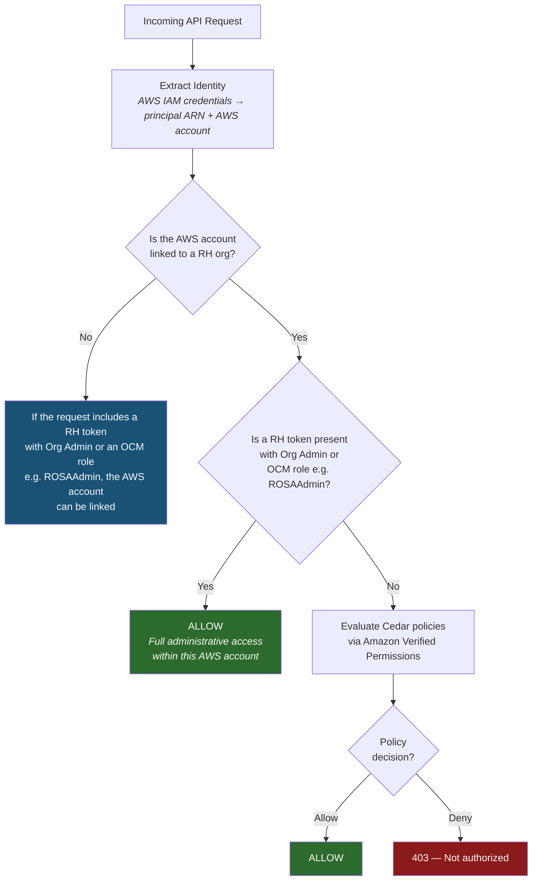

# ROSA Authorization Service

This document describes the Cedar/AVP-based authorization service for the ROSA Regional Frontend API.

## Overview

The authorization service provides fine-grained access control for ROSA operations using:

- **AWS IAM** for authentication (all requests carry AWS IAM credentials)
- **Red Hat account tokens** provided optionally for Org Admin and OCM role verification
- **Amazon Verified Permissions (AVP)** for policy evaluation
- **Cedar** as the policy language
- **DynamoDB** for storing account linkage

Identity is global: AWS IAM credentials identify the principal and AWS account, and each AWS account is linked to exactly one Red Hat organization. Authorization is regional: the tenancy boundary is **(AWS account, region)**, and Cedar policies and their attachments to principals are scoped to that boundary. A principal may have different permissions in different regions.

## Authorization Flow



```text
Request
    |
Extract Identity (AWS IAM credentials → principal ARN + AWS account)
    |
Account Linked Check
    |-- Is the AWS account linked to an RH org? → continue
    +-- Not linked → 403 "Account not linked"
    |   (Linking requires an RH token with Org Admin or an OCM role such as ROSAAdmin)
    |
Admin Check (when RH token is present)
    |-- Is the RH token valid?
    |-- Does the user hold Org Admin privileges or an OCM role (e.g. ROSAAdmin)?
    +-- All yes → ALLOW (full administrative access within this AWS account)
    |
AVP Authorization
    |-- Build AVP IsAuthorized request for this principal
    |-- Call AVP with the region's policyStoreId
    +-- Return ALLOW/DENY based on AVP decision
    |
Handler
```

## Access Levels

**Administrative access** is granted when the request includes a valid Red Hat account token and the associated user holds either:

- **Organization Administrator** privileges — global scope, applies to all regions.
- An applicable **OCM role** such as `ROSAAdmin` — currently global scope; regional scoping is under evaluation.

Admin access grants full permissions within the linked AWS account, including policy and attachment management.

**Regular IAM principals** — all other callers. Access is determined by Cedar policies evaluated via AVP, attached directly to the principal's ARN.

> **Note:** Policy management is not restricted to administrative users. A regular IAM principal can be granted a Cedar policy that authorizes policy and attachment management (e.g., via a `ManagePolicies` action). This allows delegated policy administration without requiring an RH token or OCM role.

## Tenancy and Scoping

The authorization tenancy boundary is **(AWS account, region)**. Since each AWS account maps to exactly one Red Hat organization (many-to-one: one RH org can have many AWS accounts), the RH org is implicit in the AWS account and does not need to appear separately in the tenancy tuple.

All resources, policies, and attachments within the API are scoped to this boundary — a principal operating in one AWS account and region cannot see or affect resources in a different account or region.

| Scope | What |
| --- | --- |
| **Global** | AWS IAM identity, AWS account → RH org mapping, RH Org Admin status, OCM role assignments (regional scoping for OCM roles is under evaluation) |
| **Regional (per AWS account, per region)** | Cedar policies, policy attachments, policy stores, ROSA resources (clusters, node pools, access entries). Each region has its own independent policy store. A principal may have different permissions in different regions. |

## Policy Evaluation Semantics

Cedar uses a **default-deny, permit-unless-forbid** model:

- If no policy matches, the request is **denied** (implicit deny).
- If any `permit` policy matches, the request is **allowed**.
- If any `forbid` policy matches, the request is **denied**, regardless of any matching `permit` policies.

When multiple policies are attached to a principal, all are evaluated together. A single `forbid` overrides any number of `permit` policies.

## Default Access Policy

By default, newly linked AWS accounts grant **no permissions** to any IAM principal. Permissions must be explicitly granted through Cedar policies.

Organization Administrators can attach managed policies to all IAM principals in the AWS account. For example, one available managed policy grants each principal permission to view all clusters in the AWS account and manage their own — reproducing the default behavior of the V1 API. Other managed policies will cover common patterns such as read-only access or full cluster lifecycle management.

## Data Storage

| Entity | Storage | Scope |
| --- | --- | --- |
| AWS account → RH org mapping | DynamoDB | Global |
| Policy templates | AVP | Regional (per AWS account, per region) |
| Attachments (template-linked policies) | AVP | Regional (per AWS account, per region) |
| Policy evaluation | AVP IsAuthorized API | Regional (per AWS account, per region) |

Policy templates and attachments live entirely in AVP — they are never stored in DynamoDB. Each AWS account has its own AVP policy store per region.

## API Endpoints

### Account Management (Org Admin Only)

| Method | Path | Description |
| --- | --- | --- |
| POST | `/api/v0/accounts` | Link an AWS account (creates policy store) |
| GET | `/api/v0/accounts` | List linked accounts |
| GET | `/api/v0/accounts/{id}` | Get AWS account details |
| DELETE | `/api/v0/accounts/{id}` | Unlink AWS account (deletes policy store) |

### Policy Management (Org Admin or Authorized Principal)

| Method | Path | Description |
| --- | --- | --- |
| POST | `/api/v0/authz/policies` | Create policy |
| GET | `/api/v0/authz/policies` | List policies |
| GET | `/api/v0/authz/policies/{id}` | Get policy |
| PUT | `/api/v0/authz/policies/{id}` | Update policy |
| DELETE | `/api/v0/authz/policies/{id}` | Delete policy |

### Attachment Management (Org Admin or Authorized Principal)

| Method | Path | Description |
| --- | --- | --- |
| POST | `/api/v0/authz/attachments` | Attach policy to a principal |
| GET | `/api/v0/authz/attachments` | List attachments |
| DELETE | `/api/v0/authz/attachments/{id}` | Detach policy |

Attachments bind a policy to an IAM principal ARN (user or role).

### Authorization Check

| Method | Path | Description |
| --- | --- | --- |
| POST | `/api/v0/authz/check` | Test whether a principal is authorized for a given action/resource |

> **Note:** Policy and attachment management endpoints are accessible to Organization Administrators (via RH token) and to any IAM principal that has been granted a Cedar policy authorizing policy management. The `/api/v0/authz/check` endpoint allows a principal to check their own permissions. Checking another principal's permissions requires administrative access or a Cedar policy granting the `CheckAuthorization` action.

## Policy Types

### Managed Policies

Predefined policies provided by the platform covering common use cases such as full cluster lifecycle management or read-only access. Managed policies are returned alongside custom policies via `GET /api/v0/authz/policies` and are distinguished by a `"type": "managed"` field. They cannot be modified or deleted (`PUT` and `DELETE` are rejected).

### Custom Policies

Policies written directly in [Cedar](https://docs.cedarpolicy.com/), returned with `"type": "custom"`. The `?principal` placeholder is the only template variable — when a policy is attached to a principal, the system resolves `?principal` to the concrete principal entity (an ARN within the same AWS account). Policies cannot reference principals in other AWS accounts.

Both types are attached to principals using the same `POST /api/v0/authz/attachments` endpoint.

### Best Practice

Attach policies to **IAM roles** rather than individual IAM users. Create an IAM role within the AWS account with a trust policy defining which IAM principals can assume the role, then attach ROSA policies to that role. This aligns with AWS IAM best practices and simplifies permission management.

### Principal ARN Matching

Policies can be attached at different levels of the IAM principal hierarchy:

- **Role ARN** (`arn:aws:iam::123456789012:role/DeveloperRole`) — matches all sessions that assume this role.
- **Session ARN** (`arn:aws:sts::123456789012:assumed-role/DeveloperRole/session-name`) — matches only that specific session.
- **IAM user ARN** (`arn:aws:iam::123456789012:user/alice`) — matches that user directly.

During policy evaluation, the system checks for policies attached to both the caller's exact ARN and, for assumed-role sessions, the parent role ARN. This allows broad role-level policies and narrow session-level overrides to coexist.

## ROSA Actions Reference

All actions use the `ROSA::Action` entity type in Cedar policies.

- **Cluster**
  - `CreateCluster`, `DeleteCluster`, `DescribeCluster`, `ListClusters`
  - `UpdateCluster`, `UpdateClusterConfig`, `UpdateClusterVersion`
- **NodePool**
  - `CreateNodePool`, `DeleteNodePool`, `DescribeNodePool`, `ListNodePools`
  - `UpdateNodePool`, `ScaleNodePool`
- **Access Entry**
  - `CreateAccessEntry`, `DeleteAccessEntry`, `DescribeAccessEntry`
  - `ListAccessEntries`, `UpdateAccessEntry`, `ListAccessPolicies`
- **Tagging**
  - `TagResource`, `UntagResource`, `ListTagsForResource`
- **Policy Management**
  - `CreatePolicy`, `DeletePolicy`, `DescribePolicy`, `ListPolicies`, `UpdatePolicy`
  - `CreateAttachment`, `DeleteAttachment`, `ListAttachments`

### Action Matching

AWS IAM supports wildcard matching on action strings (e.g., `rosa:Describe*`, `ec2:*`). Cedar does not support wildcards, but provides three ways to match actions in policies:

**Unconstrained `action`** — matches all actions. Equivalent to `"Action": "*"` in IAM. Use with `when`/`unless` clauses to narrow scope.

```cedar
permit(?principal, action, resource)
when { resource.tags["Environment"] == "development" };
```

**Explicit action lists** — enumerates specific actions. Required when action groups don't cover the exact set needed.

```cedar
permit(?principal,
  action in [ROSA::Action::"DescribeCluster", ROSA::Action::"DescribeNodePool",
             ROSA::Action::"DescribeAccessEntry"],
  resource);
```

**Action groups** — Cedar schemas support action hierarchies, where individual actions are members of named groups. This is the primary mechanism for matching categories of actions without listing each one.

```cedar
// Read-only access
permit(?principal, action in ROSA::Action::"ReadOnly", resource);

// Full cluster management with read and tagging
permit(
  ?principal,
  action in [ROSA::Action::"ClusterAdmin", ROSA::Action::"ReadOnly", ROSA::Action::"TagAdmin"],
  resource
);

// Everything
permit(?principal, action in ROSA::Action::"AllActions", resource);
```

The ROSA schema defines the following action groups (all members of `AllActions`):

- **`ReadOnly`** — all Describe, List actions across all resource types
- **`ClusterAdmin`** — create, delete, and update clusters
- **`NodePoolAdmin`** — create, delete, update, and scale node pools
- **`AccessEntryAdmin`** — create, delete, and update access entries
- **`TagAdmin`** — tag and untag resources
- **`PolicyAdmin`** — create, delete, and update policies and attachments

### Policy Examples

**Read-only access to all resources** — permits all Describe and List actions without allowing any mutations.

```cedar
permit(
  ?principal,
  action in [
    ROSA::Action::"DescribeCluster", ROSA::Action::"ListClusters",
    ROSA::Action::"DescribeNodePool", ROSA::Action::"ListNodePools",
    ROSA::Action::"DescribeAccessEntry", ROSA::Action::"ListAccessEntries",
    ROSA::Action::"ListTagsForResource", ROSA::Action::"ListAccessPolicies"
  ],
  resource
);
```

Or equivalently, using the `ReadOnly` action group:

```cedar
permit(?principal, action in ROSA::Action::"ReadOnly", resource);
```

**Deny delete on production clusters** — blocks cluster deletion for resources tagged as production, regardless of other policies.

```cedar
forbid(
  ?principal,
  action == ROSA::Action::"DeleteCluster",
  resource
)
when { resource.tags["Environment"] == "production" };
```

**Cluster lifecycle only** — permits full cluster management but no nodepool or access entry operations.

```cedar
permit(
  ?principal,
  action in [
    ROSA::Action::"CreateCluster", ROSA::Action::"DeleteCluster",
    ROSA::Action::"DescribeCluster", ROSA::Action::"ListClusters",
    ROSA::Action::"UpdateCluster", ROSA::Action::"UpdateClusterConfig",
    ROSA::Action::"UpdateClusterVersion",
    ROSA::Action::"TagResource", ROSA::Action::"UntagResource",
    ROSA::Action::"ListTagsForResource"
  ],
  resource
);
```

**Tag-based team scoping** — restricts a principal to resources owned by their team.

```cedar
permit(
  ?principal,
  action,
  resource
)
when { resource.tags["Team"] == "platform-engineering" };
```

**Time-based access** — restricts operations to business hours on weekdays using `context.requestTime`.

```cedar
permit(
  ?principal,
  action,
  resource
)
when { context.requestTime.dayOfWeek >= 1 && context.requestTime.dayOfWeek <= 5 }
when { context.requestTime.hour >= 9 && context.requestTime.hour < 17 };
```

**NodePool scaling only** — permits scaling node pools without allowing creation, deletion, or other modifications.

```cedar
permit(
  ?principal,
  action in [
    ROSA::Action::"ScaleNodePool",
    ROSA::Action::"DescribeNodePool",
    ROSA::Action::"ListNodePools"
  ],
  resource
);
```

## Cedar Schema

The ROSA Cedar schema defines the following entity types:

- **`ROSA::Principal`** — Users and roles identified by ARN
- **`ROSA::Resource`** — Base resource type with `tags: Map<String, String>`
- **`ROSA::Cluster`** — Inherits from Resource
- **`ROSA::NodePool`** — Inherits from Resource, belongs to a Cluster
- **`ROSA::AccessEntry`** — Inherits from Resource, belongs to a Cluster

### Resource Hierarchy

Resources have parent-child relationships: node pools and access entries belong to a cluster. Cedar's `in` operator leverages this hierarchy, allowing policies to target a cluster and automatically cover its children:

```cedar
// Grant access to a cluster and all its node pools and access entries
permit(?principal, action, resource)
when { resource in ROSA::Cluster::"cluster-123" };

// Allow nodepool scaling only on a specific cluster
permit(
  ?principal,
  action in ROSA::Action::"NodePoolAdmin",
  resource
)
when { resource in ROSA::Cluster::"cluster-456" };
```

This means a single policy scoped to a cluster covers all current and future child resources without needing to list each one individually.

## Context Attributes

Context attributes are passed alongside each AVP authorization request and can be referenced in Cedar policies via `context.<attribute>`. The available attributes are derived from the SigV4 request as it flows through API Gateway (IAM auth mode):

| Attribute | Type | Description |
| --- | --- | --- |
| `principalArn` | String | Full ARN of the calling IAM principal |
| `accountId` | String | AWS account ID of the caller |
| `sourceIp` | String | Source IP address of the request |
| `userAgent` | String | User-Agent header from the request |
| `requestTime` | Record | Request timestamp (e.g., `hour`, `dayOfWeek` fields for time-based policies) |
| `requestTags` | Map\<String, String\> | Tags provided in the request body (e.g., when creating a cluster) |

> **Note:** IAM-internal condition keys such as `aws:MultiFactorAuthPresent` and session tags (`aws:PrincipalTag/*`) are not available — API Gateway does not forward them to the backend.

## Example: Setting Up Authorization

All `rosactl` commands authenticate via the local AWS credential chain (SigV4). The AWS account ID and region are derived from the caller's AWS configuration automatically. The region can be overridden with the `--region` flag.

```bash
# 1. Configure AWS credentials and region
aws configure

# 2. Link the AWS account (as Org Admin — requires RH token)
rosactl account link --ocm-token <RH_TOKEN>

# 3. Create a Cedar policy
rosactl policy create \
  --name DevClusterAccess \
  --description "Full access to development clusters" \
  --policy-file dev-cluster-access.cedar \
  --ocm-token <RH_TOKEN>

# 4. Attach the policy to an IAM role (recommended) or user
rosactl policy attach \
  --policy-id <POLICY_ID> \
  --principal-arn arn:aws:iam::777788889999:role/DeveloperRole \
  --ocm-token <RH_TOKEN>

# 5. The IAM principal can now manage ROSA resources (no RH token needed)
rosactl cluster create my-cluster
```

Where `dev-cluster-access.cedar` contains:

```cedar
permit(
  ?principal,
  action,
  resource
)
when { resource.tags["Environment"] == "development" };
```

## Further Reading

- [Cedar Language Reference](https://docs.cedarpolicy.com/)
- [Amazon Verified Permissions Documentation](https://docs.aws.amazon.com/verifiedpermissions/)
