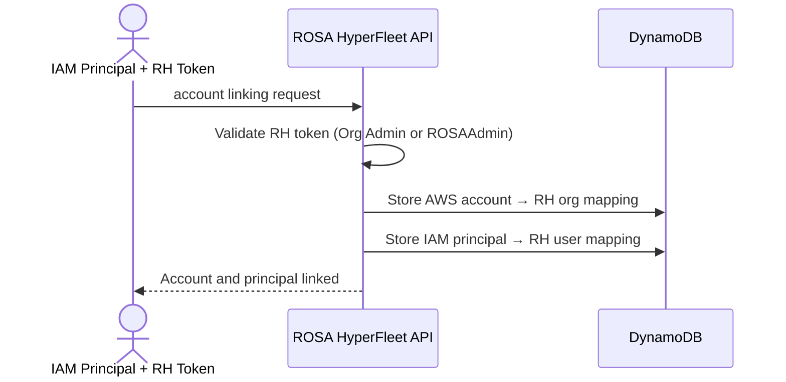
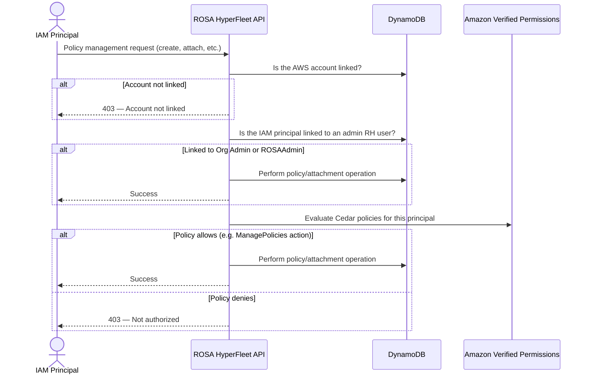
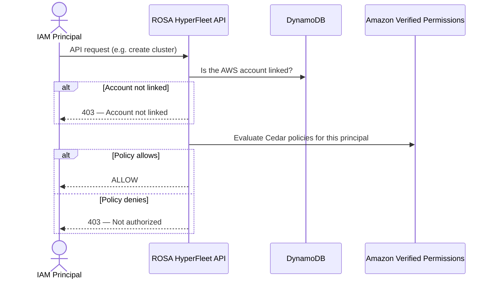

# ROSA Authorization Service

This document describes the Cedar/AVP-based authorization service for the ROSA HyperFleet API.

## Overview

The authorization service provides fine-grained access control for ROSA operations using:

- **AWS IAM** for authentication (all requests carry AWS IAM credentials)
- **Principal linking** — IAM principals can be linked to Red Hat users for administrative and policy management access
- **Amazon Verified Permissions (AVP)** for policy evaluation
- **Cedar** as the policy language
- **DynamoDB** for storing account and principal linkage

Identity is global: AWS IAM credentials identify the principal and AWS account, and each AWS account is linked to exactly one Red Hat organization. ROSA policies are global: they are defined once and apply across all regions. Attachments can be **global** (apply in all regions) or **regional** (apply in a single region). Policy evaluation is regional: each region maintains its own AVP policy store. Policies can use `context.region` to restrict which regions they take effect in.

## Authorization Flows

### AWS Account Linking and IAM Principal Linking

A Red Hat user with a valid RH token links the AWS account to the RH organization. This also links the calling IAM principal to the Red Hat user.



### Policy Management and Attachment

Policy management requires the AWS account to be linked. Access is granted either via principal linking (admin RH user) or via a Cedar policy that authorizes policy management actions.



### Regular Request Authorization

All non-administrative API requests follow this flow. Linked admin principals are granted policy and attachment management access; all other actions require Cedar policies.



## Access Levels

**Administrative access** is granted when the IAM principal is linked to a Red Hat user who holds either:

- **Organization Administrator** privileges — global scope, applies to all regions.
- An applicable **RBAC role** such as `ROSAAdmin` — global scope.

Admin access grants policy and attachment management permissions within the linked AWS account. For all other actions (e.g., cluster operations), admin principals require Cedar policies like any other principal. As admin users, they are enabled to create and attach Cedar policies to themselves or other principals.

**Regular IAM principals** — all other callers. Access is determined by Cedar policies evaluated via AVP, attached directly to the principal's ARN.

> **Note:** Policy management is not restricted to administrative users. A regular IAM principal can be granted a Cedar policy that authorizes policy and attachment management (e.g., via a `ManagePolicies` action). This allows delegated policy administration without requiring principal linking or an RBAC role.

Policy management operates at global scope — both for RH administrators and for IAM principals with delegated policy management permissions. Because ROSA policies are global, restricting an administrator to a single region would be inconsistent: a regionally-scoped admin who creates a policy would lose management authority over it if that policy is later updated to apply across multiple regions. For this reason, HyperFleet does not support regionally-scoped policy administrators.

## Principal Linking

IAM principals can be linked to a Red Hat user via `rosactl link account` (which also links the AWS account to the RH organization) or `rosactl link principal` (which links only the calling IAM principal). Multiple IAM principals can be linked to the same Red Hat user.

Account linking is subject to export control verification. When a Red Hat user is banned, their linked AWS principals are also banned, and they can no longer use the ROSA HyperFleet API to lifecycle clusters, nor access cluster APIs via aws-iam-authenticator. The clusters themselves continue to operate normally.

Principal linking grants administrative access when the linked Red Hat user holds Org Admin privileges or an RBAC role such as `ROSAAdmin`. This is the mechanism by which RH administrators gain policy and attachment management permissions without requiring a Cedar policy. Principal linking is not required for IAM principals whose access is determined solely by Cedar policies, including Cedar-based delegated policy management.

## Tenancy and Scoping

Each AWS account maps to exactly one Red Hat organization (many-to-one: one RH org can have many AWS accounts).

| Scope | What |
| --- | --- |
| **Global** | AWS IAM identity, AWS account → RH org mapping, IAM principal → RH user mapping, RH Org Admin status, RBAC role assignments, ROSA policies, global attachments |
| **Regional (per AWS account, per region)** | Regional attachments, policy evaluation (AVP policy stores), ROSA resources (clusters, node pools, access entries) |

ROSA policies are defined globally — a ROSA policy created from any region is available everywhere. Attachments can be global (replicated to all regions) or regional (stored only in the target region). To restrict a policy to specific regions, use `context.region` conditions in Cedar (see [Policy Examples](#policy-examples)), or use regional attachments to limit where a ROSA policy is applied.

Resources are regional — a cluster in `us-east-1` is not visible in `eu-west-1`. A principal operating in one AWS account cannot see or affect resources in a different AWS account.

## Policy Evaluation Semantics

Cedar uses a **default-deny, permit-unless-forbid** model:

- If no policy matches, the request is **denied** (implicit deny).
- If any `permit` policy matches, the request is **allowed**.
- If any `forbid` policy matches, the request is **denied**, regardless of any matching `permit` policies.

When multiple policies are attached to a principal, all are evaluated together. A single `forbid` overrides any number of `permit` policies.

## Default Access Policy

By default, newly linked AWS accounts grant **no permissions** to any IAM principal. Permissions must be explicitly granted through Cedar policies.

Organization Administrators can attach managed ROSA policies to any IAM principals in the AWS account. For example, one available ROSA managed policy grants each principal permission to view all clusters in the AWS account and manage their own — reproducing the default behavior of the V1 API. Other managed ROSA policies will cover common patterns such as read-only access or full cluster lifecycle management.

## Data Storage

| Entity | Storage | Scope |
| --- | --- | --- |
| AWS account → RH org mapping | DynamoDB Global Tables | Global |
| IAM principal → RH user mapping | DynamoDB Global Tables | Global |
| ROSA policy templates | DynamoDB Global Tables | Global |
| Global attachments | DynamoDB Global Tables | Global |
| Regional attachments | DynamoDB (regional, non-global) | Regional |
| Policy evaluation | AVP IsAuthorized API | Regional (per AWS account, per region) |

DynamoDB Global Tables are the source of truth for ROSA policies and global attachments. Regional attachments are stored in a standard (non-global) DynamoDB table in each region. AVP is used only for evaluation — it is not the source of truth.

## API Endpoints

### Account Management (Org Admin Only)

| Method | Path | Description |
| --- | --- | --- |
| POST | `/api/v0/accounts` | Link an AWS account (creates policy store) |
| GET | `/api/v0/accounts` | List linked accounts |
| GET | `/api/v0/accounts/{id}` | Get AWS account details |
| DELETE | `/api/v0/accounts/{id}` | Unlink AWS account (deletes policy store) |

### Policy Management (Org Admin or Authorized Principal)

| Method | Path | Description |
| --- | --- | --- |
| POST | `/api/v0/authz/policies` | Create policy |
| GET | `/api/v0/authz/policies` | List policies |
| GET | `/api/v0/authz/policies/{id}` | Get policy |
| PUT | `/api/v0/authz/policies/{id}` | Update policy |
| DELETE | `/api/v0/authz/policies/{id}` | Delete policy |

### Attachment Management (Org Admin or Authorized Principal)

| Method | Path | Description |
| --- | --- | --- |
| POST | `/api/v0/authz/attachments` | Attach policy to a principal (global or regional) |
| GET | `/api/v0/authz/attachments` | List attachments (global + current region's regional) |
| DELETE | `/api/v0/authz/attachments/{id}` | Detach policy |

Attachments bind a ROSA policy to an IAM principal ARN (user or role). Attachments are **global** by default. Pass `--regional` to create a regional attachment that applies only in the current region.

> **Note:** If a regional attachment is being created with a condition on `context.region` that does not match the current region, the attachment will be created but it will not be effective. The user creating the attachment will receive a warning message.

`rosactl get attachments` returns all global attachments plus regional attachments for the current region. `rosactl get attachments --all-regions` fans out to each region's API to include regional attachments from all regions.

### Authorization Check

| Method | Path | Description |
| --- | --- | --- |
| POST | `/api/v0/authz/check` | Test whether a principal is authorized for a given action/resource |

> **Note:** Policy and attachment management endpoints are accessible to Organization Administrators (via RH token) and to any IAM principal that has been granted a Cedar policy authorizing policy management. The `/api/v0/authz/check` endpoint allows a principal to check their own permissions. Checking another principal's permissions requires administrative access or a Cedar policy granting the `CheckAuthorization` action.

## ROSA Policy Types

ROSA policies are distinct from AWS IAM policies — they are ROSA-specific policy definitions stored and managed through the HyperFleet API.

### Managed ROSA Policies

Predefined ROSA policies provided by the platform covering common use cases such as full cluster lifecycle management or read-only access. managed ROSA policies are returned alongside custom policies via `GET /api/v0/authz/policies` and are distinguished by a `"type": "managed"` field. They cannot be modified or deleted (`PUT` and `DELETE` are rejected).

### ROSA Custom Policies

ROSA policies written directly in [Cedar](https://docs.cedarpolicy.com/), returned with `"type": "custom"`. The `?principal` placeholder is the only template variable — when a policy is attached to a principal, the system resolves `?principal` to the concrete principal entity (an ARN within the same AWS account). Policies cannot reference principals in other AWS accounts.

Both ROSA policy types are attached to principals using the same `POST /api/v0/authz/attachments` endpoint.

### Best Practice

Attach policies to **IAM roles** rather than individual IAM users. Create an IAM role within the AWS account with a trust policy defining which IAM principals can assume the role, then attach ROSA policies to that role. This aligns with AWS IAM best practices and simplifies permission management.

### Principal ARN Matching

Policies can be attached at different levels of the IAM principal hierarchy:

- **Role ARN** (`arn:aws:iam::123456789012:role/DeveloperRole`) — matches all sessions that assume this role.
- **Session ARN** (`arn:aws:sts::123456789012:assumed-role/DeveloperRole/session-name`) — matches only that specific session.
- **IAM user ARN** (`arn:aws:iam::123456789012:user/alice`) — matches that user directly.

During policy evaluation, the system checks for policies attached to both the caller's exact ARN and, for assumed-role sessions, the parent role ARN. This allows broad role-level policies and narrow session-level overrides to coexist.

## ROSA Actions Reference

> **Note:** The actions listed below are illustrative examples, not an exhaustive catalog. The definitive set of actions is defined in the Cedar schema and will evolve as the API surface grows.

All actions use the `ROSA::Action` entity type in Cedar policies.

- **Cluster**
  - `CreateCluster`, `DeleteCluster`, `DescribeCluster`, `ListClusters`
  - `UpdateCluster`, `UpdateClusterConfig`, `UpdateClusterVersion`
- **NodePool**
  - `CreateNodePool`, `DeleteNodePool`, `DescribeNodePool`, `ListNodePools`
  - `UpdateNodePool`, `ScaleNodePool`
- **Access Entry**
  - `CreateAccessEntry`, `DeleteAccessEntry`, `DescribeAccessEntry`
  - `ListAccessEntries`, `UpdateAccessEntry`, `ListAccessPolicies`
- **Label**
  - `LabelResource`, `DeleteLabelFromResource`, `ListLabelsForResource`
- **Policy Management**
  - `CreatePolicy`, `DeletePolicy`, `DescribePolicy`, `ListPolicies`, `UpdatePolicy`
  - `CreateAttachment`, `DeleteAttachment`, `ListAttachments`
  - `CreateAttachmentRegional`, `DeleteAttachmentRegional`, `ListAttachmentsRegional`

> **Note:** `*AttachmentRegional` only permits the creation of attachments that are scoped to a region, not global. This allows us to have regional permissions admins.

### Action Matching

AWS IAM supports wildcard matching on action strings (e.g., `rosa:Describe*`, `ec2:*`). Cedar does not support wildcards, but provides three ways to match actions in policies:

**Unconstrained `action`** — matches all actions. Equivalent to `"Action": "*"` in IAM. Use with `when`/`unless` clauses to narrow scope.

```cedar
permit(?principal, action, resource)
when { resource.labels["Environment"] == "development" };
```

**Explicit action lists** — enumerates specific actions. Required when action groups don't cover the exact set needed.

```cedar
permit(?principal,
  action in [ROSA::Action::"DescribeCluster", ROSA::Action::"DescribeNodePool",
             ROSA::Action::"DescribeAccessEntry"],
  resource);
```

**Action groups** — Cedar schemas support action hierarchies, where individual actions are members of named groups. This is the primary mechanism for matching categories of actions without listing each one.

```cedar
// Read-only access
permit(?principal, action in ROSA::Action::"ReadOnly", resource);

// Full cluster management with read and labeling
permit(
  ?principal,
  action in [ROSA::Action::"ClusterAdmin", ROSA::Action::"ReadOnly", ROSA::Action::"LabelAdmin"],
  resource
);

// Everything
permit(?principal, action in ROSA::Action::"AllActions", resource);
```

The ROSA schema defines the following action groups (all members of `AllActions`):

- **`ReadOnly`** — all Describe, List actions across all resource types
- **`ClusterAdmin`** — create, delete, and update clusters
- **`NodePoolAdmin`** — create, delete, update, and scale node pools
- **`AccessEntryAdmin`** — create, delete, and update access entries
- **`LabelAdmin`** — label and unlabel resources
- **`PolicyAdmin`** — create, delete, and update policies and attachments

### Policy Examples

**Read-only access to all resources** — permits all Describe and List actions without allowing any mutations.

```cedar
permit(
  ?principal,
  action in [
    ROSA::Action::"DescribeCluster", ROSA::Action::"ListClusters",
    ROSA::Action::"DescribeNodePool", ROSA::Action::"ListNodePools",
    ROSA::Action::"DescribeAccessEntry", ROSA::Action::"ListAccessEntries",
    ROSA::Action::"ListLabelsForResource", ROSA::Action::"ListAccessPolicies"
  ],
  resource
);
```

Or equivalently, using the `ReadOnly` action group:

```cedar
permit(?principal, action in ROSA::Action::"ReadOnly", resource);
```

**Deny delete on production clusters** — blocks cluster deletion for resources labeled as production, regardless of other policies.

```cedar
forbid(
  ?principal,
  action == ROSA::Action::"DeleteCluster",
  resource
)
when { resource.labels["Environment"] == "production" };
```

**Cluster lifecycle only** — permits full cluster management but no nodepool or access entry operations.

```cedar
permit(
  ?principal,
  action in [
    ROSA::Action::"CreateCluster", ROSA::Action::"DeleteCluster",
    ROSA::Action::"DescribeCluster", ROSA::Action::"ListClusters",
    ROSA::Action::"UpdateCluster", ROSA::Action::"UpdateClusterConfig",
    ROSA::Action::"UpdateClusterVersion",
    ROSA::Action::"LabelResource", ROSA::Action::"UnlabelResource",
    ROSA::Action::"ListLabelsForResource"
  ],
  resource
);
```

**Label-based team scoping** — restricts a principal to resources owned by their team.

```cedar
permit(
  ?principal,
  action,
  resource
)
when { resource.labels["Team"] == "platform-engineering" };
```

**Time-based access** — restricts operations to business hours on weekdays using `context.requestTime`. `requestTime` fields (`hour`, `dayOfWeek`) are expressed in UTC.

```cedar
permit(
  ?principal,
  action,
  resource
)
when { context.requestTime.dayOfWeek >= 1 && context.requestTime.dayOfWeek <= 5 }
when { context.requestTime.hour >= 9 && context.requestTime.hour < 17 };
```

**Region restriction** — since policies are global, use `context.region` to restrict which regions they apply in. Equivalent to IAM's `aws:RequestedRegion` condition.

```cedar
// Allow all actions, but only in us-east-1 and us-west-2
permit(?principal, action, resource)
when { context.region in ["us-east-1", "us-west-2"] };
```
> **Note:** In order for this policy to take effect, the IAM principal must have a corresponding attachment in the specified regions, either globally or regionally.

```cedar
// Deny all actions outside approved regions
forbid(?principal, action, resource)
unless { context.region in ["us-east-1", "us-west-2"] };
```

**NodePool scaling only** — permits scaling node pools without allowing creation, deletion, or other modifications.

```cedar
permit(
  ?principal,
  action in [
    ROSA::Action::"ScaleNodePool",
    ROSA::Action::"DescribeNodePool",
    ROSA::Action::"ListNodePools"
  ],
  resource
);
```

## Cedar Schema

The ROSA Cedar schema defines the following entity types:

- **`ROSA::Principal`** — Users and roles identified by ARN
- **`ROSA::Resource`** — Base resource type with `labels: Map<String, String>`
- **`ROSA::Cluster`** — Inherits from Resource
- **`ROSA::NodePool`** — Inherits from Resource, belongs to a Cluster
- **`ROSA::AccessEntry`** — Inherits from Resource, belongs to a Cluster

### Resource Hierarchy

Resources have parent-child relationships: node pools and access entries belong to a cluster. Cedar's `in` operator leverages this hierarchy, allowing policies to target a cluster and automatically cover its children:

```cedar
// Grant access to a cluster and all its node pools and access entries
permit(?principal, action, resource)
when { resource in ROSA::Cluster::"cluster-123" };

// Allow nodepool scaling only on a specific cluster
permit(
  ?principal,
  action in ROSA::Action::"NodePoolAdmin",
  resource
)
when { resource in ROSA::Cluster::"cluster-456" };
```

This means a single policy scoped to a cluster covers all current and future child resources without needing to list each one individually.

## Context Attributes

Context attributes are passed alongside each AVP authorization request and can be referenced in Cedar policies via `context.<attribute>`. The available attributes are derived from the SigV4 request as it flows through API Gateway (IAM auth mode):

| Attribute | Type | Description |
| --- | --- | --- |
| `region` | String | AWS region where the request is being evaluated (e.g., `us-east-1`) |
| `principalArn` | String | Full ARN of the calling IAM principal |
| `accountId` | String | AWS account ID of the caller |
| `sourceIp` | String | Source IP address of the request |
| `userAgent` | String | User-Agent header from the request |
| `requestTime` | Record | Request timestamp with `hour`, `dayOfWeek`, and `timezone` fields for time-based policies. The `timezone` field (IANA tz name, e.g., `America/New_York`) is mandatory in time-based conditions |
| `requestLabels` | Map\<String, String\> | Labels provided in the request body (e.g., when creating a cluster) |

> **Note:** IAM-internal condition keys such as `aws:MultiFactorAuthPresent` and session tags (`aws:PrincipalTag/*`) are not available — API Gateway does not forward them to the backend.

## Example: Setting Up Authorization

All `rosactl` commands authenticate via the local AWS credential chain (SigV4). The AWS account ID and region are derived from the caller's AWS configuration automatically. The region can be overridden with the `--region` flag.

### Initial Bootstrap

The user executing this flow is either a Red Hat Org Admin or holds a role in the Platform RBAC service such as `ROSAAdmin`. The user has a valid Red Hat account token (RH token).

```bash
# 1. Configure AWS credentials and region
aws configure

# 2. Links the AWS account (as Admin — requires RH token)
# It also links the IAM principal to the Red Hat User.
rosactl link account --rh-token <RH_TOKEN>

# 3. Create a Cedar policy
rosactl policy create \
  --name DevClusterAccess \
  --description "Full access to development clusters" \
  --policy-file dev-cluster-access.cedar

# 4. Attach the policy to an IAM role (recommended) or user
rosactl policy attach \
  --policy-id <POLICY_ID> \
  --principal-arn arn:aws:iam::777788889999:role/DeveloperRole
```

Where `dev-cluster-access.cedar` contains:

```cedar
permit(
  ?principal,
  action,
  resource
)
when { resource.labels["Environment"] == "development" };
```

### Policy Management for additional Red Hat admins

The user executing this flow is either a Red Hat Org Admin or holds a role in the Platform RBAC service such as `ROSAAdmin`. The user has a valid Red Hat account token (RH token).

```bash
# 1. Configure AWS credentials and region
aws configure

# 2. Links the IAM principal to the Red Hat User.
# Note that several IAM principals can be linked to
# the same Red Hat user.
rosactl link principal --rh-token <RH_TOKEN>

# 3. Create a Cedar policy
rosactl policy create \
  --name DevClusterAccess \
  --description "Full access to development clusters" \
  --policy-file dev-cluster-access.cedar

# 4. Attach the policy to an IAM role (recommended) or user
# Omit --regional for a global attachment (applies in all regions)
# Use --regional to create a regional attachment (applies only in the current region)
rosactl policy attach \
  [ --regional ] \
  --policy-id <POLICY_ID> \
  --principal-arn arn:aws:iam::777788889999:role/DeveloperRole
```

### Regular user access

In this example the principal is `arn:aws:iam::777788889999:role/DeveloperRole` from the example above.

Note that regular users do not have to run `rosactl link principal`. Their permissions must be explicitly granted within HyperFleet itself by Red Hat admins (see examples above).

```bash
# 1. Configure AWS credentials and region
aws configure

# 2. List clusters
rosactl cluster list

# 3. Create a cluster
rosactl cluster create my-cluster
```

## Further Reading

- [Cedar Language Reference](https://docs.cedarpolicy.com/)
- [Amazon Verified Permissions Documentation](https://docs.aws.amazon.com/verifiedpermissions/)
